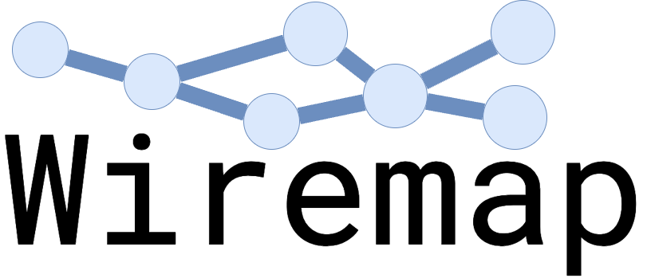
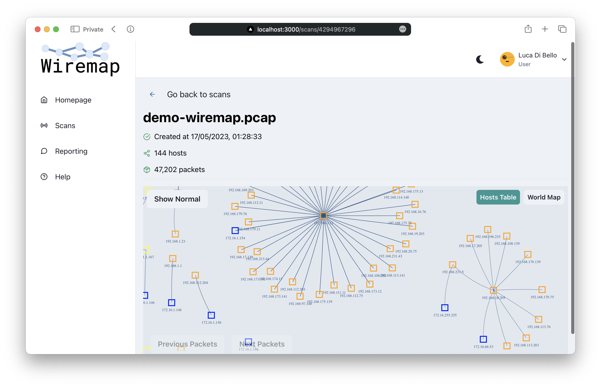
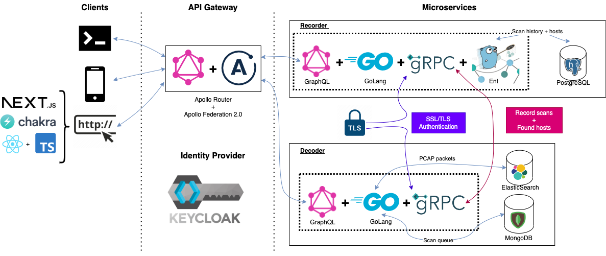
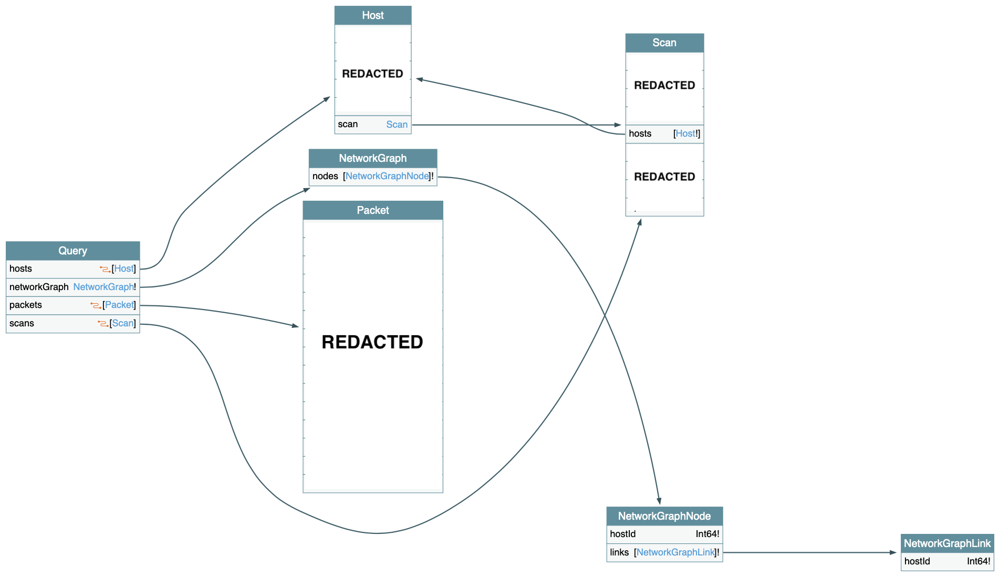
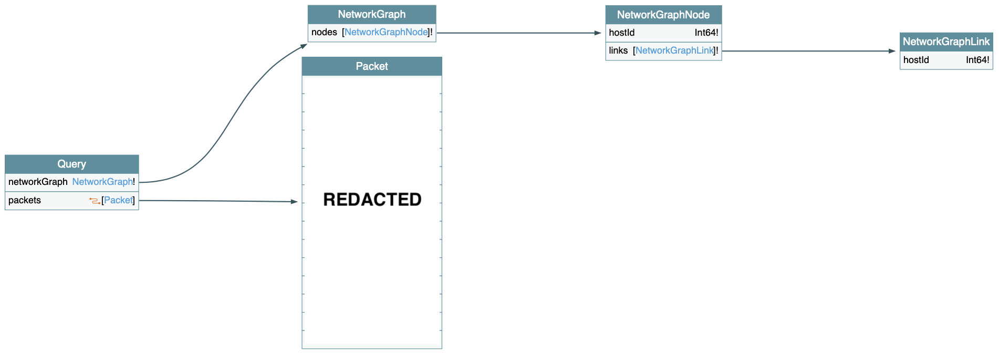
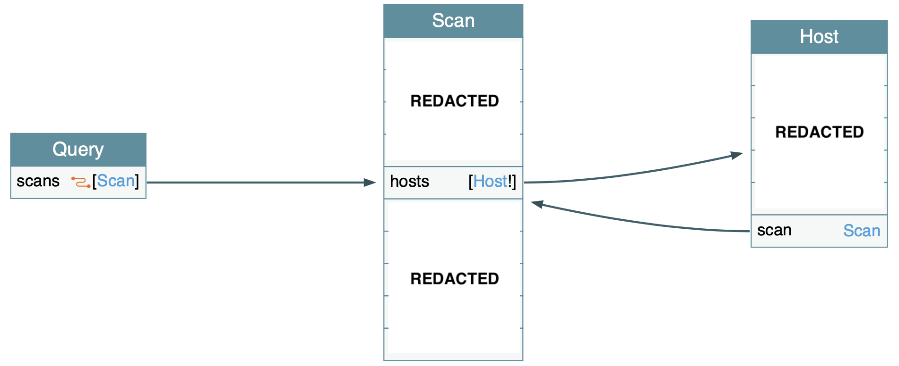
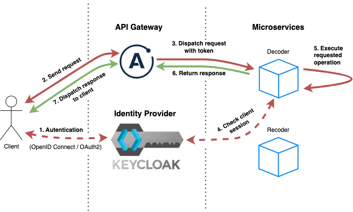
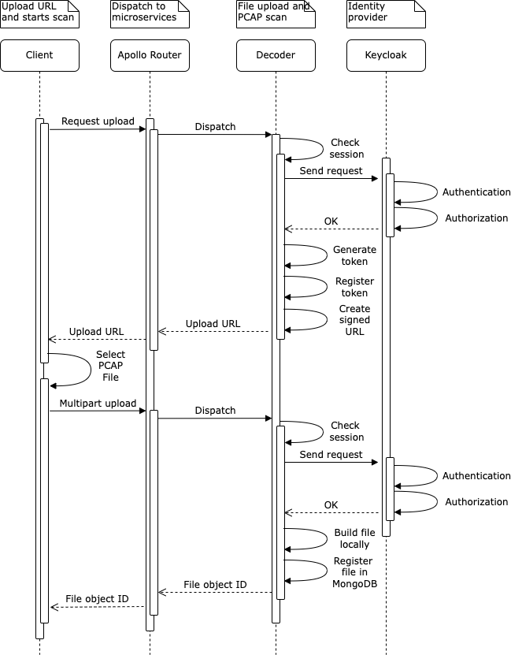
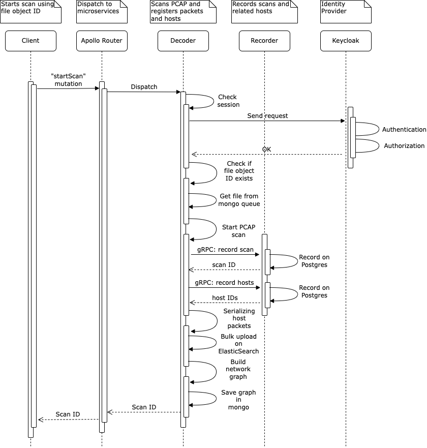

# Wiremap - Redacted version <!-- omit in toc -->

<p align="center">
	<picture>
		<source media="(prefers-color-scheme: dark)" srcset="./doc/logo/logo-white.png">
		<source media="(prefers-color-scheme: light)" srcset="./doc/logo/logo-black.png">
		
	</picture>
</p>

<p align="center"><strong>🛰️ A sophisticated network mapper and analyser</strong></p>

> IMPORTANT NOTICE: This repository serves as a demonstration of the confidential project "Wiremap" and is meant for showcase purposes only. We have taken precautions to remove any sensitive information such as academic papers, screenshots, source code, and specific technical details from this repository.

## Table of Contents <!-- omit in toc -->

- [1. Abstract](#1-abstract)
- [2. Showcase video](#2-showcase-video)
- [3. System architecture](#3-system-architecture)
- [4. Tech stack](#4-tech-stack)
	- [4.1. Frontend](#41-frontend)
	- [4.2. Backend](#42-backend)
		- [4.2.1. Decoder Microservice](#421-decoder-microservice)
		- [4.2.2. Recorder microservice](#422-recorder-microservice)
		- [4.2.3. API gateway](#423-api-gateway)
		- [4.2.4. Keycloak](#424-keycloak)
- [5. Getting started](#5-getting-started)
- [6. Wiremap inner workings](#6-wiremap-inner-workings)
	- [6.1. GraphQL federation diagram](#61-graphql-federation-diagram)
		- [6.1.1. `decoder` GraphQL diagram](#611-decoder-graphql-diagram)
		- [6.1.2. `recorder` GraphQL diagram](#612-recorder-graphql-diagram)
	- [6.2. Client authentication flow](#62-client-authentication-flow)
	- [6.3. Client file upload through the API Gateway](#63-client-file-upload-through-the-api-gateway)
	- [6.4. PCAP file decoding, scanning and indexing](#64-pcap-file-decoding-scanning-and-indexing)
- [7. Additional material](#7-additional-material)
- [8. Directory structure](#8-directory-structure)
- [9. Additional tools](#9-additional-tools)

## 1. Abstract

Wiremap is a comprehensive, self-contained network traffic analysis system developed to meet the challenges posed by the increasing complexity of networks. The main objective of the project was to provide a high-quality tool capable of analyzing large amounts of network data, providing an overview of the network topology and its components.

The system was designed to ensure a highly scalable and maintainable architecture capable of delivering high performance. To achieve this goal, we chose to use technologies such as Go, gRPC, Keycloak, and GraphQL, which allowed us to implement a microservice architecture that can guarantee high availability and sustain any traffic peaks.

The results obtained show that Wiremap can analyze large amounts of data accurately and quickly, providing a detailed map of the network. In addition, due to the microservice architecture design chosen, the system is highly scalable and can be easily expanded with new features.

In conclusion, Wiremap is a high-quality and secure tool that allows both experienced and novice users to get an overview of a network, identifying its different hosts and the packets they send. The logical relationships among the various hosts in the network are represented by an interactive graph, which gives the end user a powerful tool to visualize the information in a direct and meaningful way.

Keywords: *wiremap, network analysis, microservices, scalability, security*

## 2. Showcase video

> IMPORTANT NOTICE: Due to the confidential nature of the project, we redacted the video to remove any sensitive information. Please, refer to the [showcase](./doc/showcase/README.md) directory to have a glimpse of the project.



## 3. System architecture

<p align="center">
	
</p>

## 4. Tech stack

The project is divided into two parts: the frontend and the backend. The frontend is a [Next.js](https://nextjs.org/) application written in [TypeScript](https://www.typescriptlang.org/) and the backend is a set of microservices written in [Go](https://golang.org/). The communication between the frontend and the backend is done through a [GraphQL Federation](https://www.apollographql.com/docs/federation/) gateway, which provides a single API endpoint for all clients. This approach simplifies the communication between clients and services and makes it easier to scale the system horizontally as needed. The authentication is done through [Keycloak](https://www.keycloak.org/), an open-source identity and access management solution.

### 4.1. Frontend

In the frontend, we use [React](https://reactjs.org/) with [TypeScript](https://www.typescriptlang.org/) and [Chakra UI](https://chakra-ui.com/) to build a modern and responsive user interface. The communication with the backend is done through [Apollo Client](https://www.apollographql.com/docs/react/), which provides a simple and powerful way to query the data. To cache the data, we use [Stale While Revalidate](https://swr.vercel.app/), which provides a great user experience by showing the cached data while fetching the latest data from the server.

- [React](https://reactjs.org/)
- [TypeScript](https://www.typescriptlang.org/)
- [Next.js](https://nextjs.org/)
- [Chakra UI](https://chakra-ui.com/)
- [Apollo Client](https://www.apollographql.com/docs/react/)
- [Stale While Revalidate](https://swr.vercel.app/)

### 4.2. Backend

The backend has a microservice architecture, with two services:

1. `decoder`, view the [README](./decoder/README.md)
2. `recorder`, view the [README](./recorder/README.md)

Our project is a set of services that are written entirely in [Go](https://golang.org/). The communication between clients and services is done through a [GraphQL Federation](https://www.apollographql.com/docs/federation/) gateway, which provides a single API endpoint for all clients. This approach simplifies the communication between clients and services and makes it easier to scale the system horizontally as needed.

To create the federation, we use Apollo's [Rover CLI](https://www.apollographql.com/docs/rover/) to build a [supergraph](https://www.apollographql.com/supergraph/). This supergraph is self-hosted using [Apollo Router](ttps://www.apollographql.com/docs/router/), which allows us to easily scale the services horizontally by adding more replicas, as well as add new services without having to change the clients. It also masks the internal architecture of the services from the clients, providing an extra layer of security.

To ensure secure authentication and authorization of our users, we use [Keycloak](https://www.keycloak.org/) - an open source Identity and Access Management solution. The authentication is done using [OpenID Connect](https://openid.net/connect/), which provides a secure and easy-to-use authentication mechanism. The authorization is done using [Keycloak's Authorization Services](https://www.keycloak.org/docs/latest/authorization_services/), which provide fine-grained access control to our services.

By using these technologies, we have created a scalable, secure and maintainable architecture for our project. We hope that this documentation will help you understand our project better.

In addition, all the GraphQL queries follows [relay.dev Cursor Connections Specification](https://relay.dev/graphql/connections.htm) to provide a standardized way to paginate through the data.

#### 4.2.1. Decoder Microservice

Decodes PCAP files and stores the extracted packets into ElasticSearch. It also provides a GraphQL API to query the data.

Tech stack:

- [Go](https://golang.org/)
- [ElasticSearch](https://www.elastic.co/) + [Kibana](https://www.elastic.co/kibana)
- [gqlgen](https://gqlgen.com/)
- [gopacket](https://github.com/google/gopacket)
- [gRPC](https://grpc.io/)

#### 4.2.2. Recorder microservice

Keeps track of the scanned PCAP files and the hosts that were found during the scan. It also provides a GraphQL API to query the data.
  
Tech stack:

- [Go](https://golang.org/)
- [PostgreSQL](https://www.postgresql.org/)
- [gqlgen](https://gqlgen.com/)
- [Ent](https://entgo.io/)
- [gRPC](https://grpc.io/)

#### 4.2.3. API gateway

The API gateway is a [GraphQL Federation](https://www.apollographql.com/docs/federation/) gateway that provides a single API endpoint for all the clients. The router is self-hosted using [Apollo Router](https://www.apollographql.com/docs/router/) which provides a precompiled Rust binary that runs as a standalone server. It includes a built-in [OpenTelemetry](https://opentelemetry.io/) collector that can be used to collect metrics and traces from the services and also [Apollo Studio Explorer](https://www.apollographql.com/docs/studio/explorer/) which provides a web interface to explore and query the supergraph.

#### 4.2.4. Keycloak

While traditional JWT tokens can provide a simple and lightweight way to handle user authentication and authorization, they can be difficult to manage and secure at scale. Keycloak provides a centralized and scalable solution that simplifies user management and enables fine-grained access control across our services (see [Keycloak documentation](https://www.keycloak.org/documentation.html)).

With Keycloak, we can easily set up and manage user accounts, groups, and roles, and define policies for user authentication and authorization. Keycloak also supports various authentication mechanisms, including username/password, social logins, and multi-factor authentication, making it easier to implement secure and user-friendly authentication in our services.

Another advantage of Keycloak is that it supports OAuth 2.0 and OpenID Connect protocols, which are widely used in modern web applications and provide additional security features like token revocation and refresh tokens. Keycloak also provides integration with external identity providers like Google, Facebook, and GitHub (see [Server Administration Guide](https://www.keycloak.org/docs/latest/server_admin/index.html)), making it easier to implement single sign-on (SSO) across our services.

In summary, Keycloak provides a comprehensive and secure solution for user authentication and authorization, with features like centralized user management, fine-grained access control, and support for modern authentication protocols. These features make it easier to implement secure and scalable authentication in our services, which is why we chose to use Keycloak in our project.

## 5. Getting started

Please, follow the [Getting Started Guide](./doc/getting-started-guide/getting-started.md) to run the project.

The guide will walk you through the process of setting up the project and running it locally.

## 6. Wiremap inner workings

In this section, we will describe the inner workings of *Wiremap*. We will start by describing how we integrated Keycloak with the client and microservices. Then, we will describe how we implemented the file upload process and, at last, will be described how a file scan is performed in *Wiremap*.

### 6.1. GraphQL federation diagram

This diagram shows the resulting GraphQL schema after the federation process:



As we can see, the `decoder` and `recorder` services are federated to the `router` service. The `router` service is the only service exposed to the client. The `router` service is responsible for routing the requests to the correct service.

> IMPORTANT NOTICE: Some information has been redacted from the diagram to protect the confidentiality of the project.

#### 6.1.1. `decoder` GraphQL diagram

This diagram shows the GraphQL schema of the `decoder` service:



> IMPORTANT NOTICE: Some information has been redacted from the diagram to protect the confidentiality of the project.

#### 6.1.2. `recorder` GraphQL diagram

This diagram shows the GraphQL schema of the `recorder` service:



> IMPORTANT NOTICE: Some information has been redacted from the diagram to protect the confidentiality of the project.

### 6.2. Client authentication flow

In *Wiremap*, the clients authenticates using [OpenID Connect](https://openid.net/connect/) protocol against `wiremap` realm in Keycloak.

In the following diagram, we can see the authentication flow of a client interacting with a microservice through the API Gateway:



### 6.3. Client file upload through the API Gateway

To optimize file uploading in the decoder service, we use a two-step process inspired by Google and Amazon APIs. When a user wants to upload a file, they first send a request to the API Gateway with the file metadata. The API Gateway then returns a signed URL, which the user can use to upload the file directly to the decoder service. This approach has two main advantages:

- The API Gateway is not required to handle large files, as the user uploads the file directly to a decoder microservice instance

- There is no need to store the file in the API Gateway or any other storage service since the file is uploaded directly to the decoder service where it will later be processed.

The following diagram shows the two-step process for uploading a file:



> Apollo published a [blog post](https://www.apollographql.com/blog/backend/file-uploads/file-upload-best-practices/) about the best practices for file uploading in GraphQL-based services.

### 6.4. PCAP file decoding, scanning and indexing

The following diagram provides an overview of the decoding, scanning, and indexing process of a PCAP file. Once the client uploads the file, it sends a `startScan` mutation to the decoder service, specifying the file ID that the user wants to scan. The router then dispatches this request to the decoder service, which begins the decoding process.

To ensure secure access, the decoder service validates the user session token, using the Keycloak [JWKs](https://auth0.com/docs/secure/tokens/json-web-tokens/json-web-key-sets) endpoint as part of its [OpenID Connect configuration endpoint](https://stackoverflow.com/questions/28658735/what-are-keycloaks-oauth2-openid-connect-endpoints). Once validated, the decoder service retrieves the file path from MongoDB and initiates the decoding process using the [gopacket](https://github.com/google/gopacket) library. During this process, the decoder service extracts all unique hosts and their packets, and records the scan by sending a gRPC `RecordScan` message to the recorder service. The recorder service then validates the user session token, stores the scan in PostgreSQL, and returns the scan ID to the decoder service.

Next, the decoder service records each host by sending a gRPC `RecordHost` message to the recorder service. After validation, the recorder service stores the host in PostgreSQL and returns the host ID to the decoder service. Each packet is then linked to its corresponding host ID (returned by the recorder microservice) and saved in ElasticSearch using the [Bulk API](https://www.elastic.co/guide/en/elasticsearch/reference/current/docs-bulk.html).

Once the decoding process is complete, a network graph is generated and saved in MongoDB using the specified format:



## 7. Additional material

- User guides
  - [Getting started guide](./doc/getting-started-guide/getting-started.md)
  - [`decoder` microservice configuration guide](./decoder/configs/README.md)
  - [`recorder` microservice configuration guide](./recorder/configs/README.md)
- Academic material
  - Paper: **Redacted**
  - Poster: **Redacted**
  - Presentation: **Redacted**

## 8. Directory structure

The following diagram shows the directory structure of the project:

```bash
.
├── client # Client web application (Next.js + Typescript + ChakraUI)
├── decoder # Decoder microservice (Golang + gRPC + GraphQL)
├── recorder # Recorder microservice (Golang + gRPC + gRPC)
├── router # API Gateway (Apollo Federation 2.0 + Apollo Router)
├── keycloak # Keycloak (Identity and Access Management)
├── grpc # gRPC proto files and Go code generation
└── doc # Documentation (diagrams, etc.)
```

## 9. Additional tools

- [**Snyk**](https://snyk.io/) - Snyk is a developer-first platform that helps developers use open source code and stay secure. Snyk’s CLI and CI/CD plugins identify vulnerabilities and license issues in open source dependencies, helping developers fix them early in the development process.
