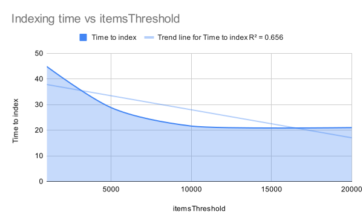

# Wiremap - Decoder microservice configuration manual <!-- omit in toc -->
Written by Luca Di Bello - luca.dibello@student.supsi.ch - 2022/2023 - Version 1.0.0  <!-- omit in toc -->

## Table of contents <!-- omit in toc -->

- [1. Default config file](#1-default-config-file)
- [2. Config file explained](#2-config-file-explained)
  - [2.1. `elastic`](#21-elastic)
    - [2.1.1. `name`](#211-name)
    - [2.1.2. `addresses`](#212-addresses)
    - [2.1.3. `username`](#213-username)
    - [2.1.4. `password`](#214-password)
    - [2.1.5. `indices`](#215-indices)
      - [2.1.5.1. `autoCreate`](#2151-autocreate)
      - [2.1.5.2. `indicesDirectory`](#2152-indicesdirectory)
    - [2.1.6. `indexer`](#216-indexer)
      - [2.1.6.1. `itemsThreshold`](#2161-itemsthreshold)
  - [2.2. `mongo`](#22-mongo)
    - [2.2.1. `host`](#221-host)
    - [2.2.2. `port`](#222-port)
    - [2.2.3. `user`](#223-user)
    - [2.2.4. `password`](#224-password)
  - [2.3. `database`](#23-database)
    - [2.3.1. `collections`](#231-collections)
      - [2.3.1.1. `queue`](#2311-queue)
      - [2.3.1.2. `challenges`](#2312-challenges)
      - [2.3.1.3. `networkMaps`](#2313-networkmaps)
  - [2.4. `logger`](#24-logger)
    - [2.4.1. `level`](#241-level)
    - [2.4.2. `prefix`](#242-prefix)
    - [2.4.3. `logFilePath`](#243-logfilepath)
  - [2.5. `webserver`](#25-webserver)
    - [2.5.1. `graphqlPlaygroundEnabled`](#251-graphqlplaygroundenabled)
    - [2.5.2. `host`](#252-host)
    - [2.5.3. `port`](#253-port)
    - [2.5.4. `cors`](#254-cors)
      - [2.5.4.1. `origins`](#2541-origins)
      - [2.5.4.2. `methods`](#2542-methods)
      - [2.5.4.3. `maxAge`](#2543-maxage)
      - [2.5.4.4. `debug`](#2544-debug)
    - [2.5.5. `upload`](#255-upload)
      - [2.5.5.1. `uploadUrlFormat`](#2551-uploadurlformat)
      - [2.5.5.2. `maxUploadSize`](#2552-maxuploadsize)
      - [2.5.5.3. `supportedExtensions`](#2553-supportedextensions)
  - [2.6. `scanner`](#26-scanner)
    - [2.6.1. `queueDirectory`](#261-queuedirectory)
  - [2.7. `signer`](#27-signer)
    - [2.7.1. `claims`](#271-claims)
      - [2.7.1.1. `issuer`](#2711-issuer)
    - [2.7.2. `challenge`](#272-challenge)
      - [2.7.2.1. `audience`](#2721-audience)
      - [2.7.2.2. `expiresIn`](#2722-expiresin)
    - [2.7.3. `certificates`](#273-certificates)
      - [2.7.3.1. `privateKeyPath`](#2731-privatekeypath)
      - [2.7.3.2. `publicKeyPath`](#2732-publickeypath)
  - [2.8. `recorder`](#28-recorder)
    - [2.8.1. `grpc`](#281-grpc)
      - [2.8.1.1. `host`](#2811-host)
      - [2.8.1.2. `port`](#2812-port)
      - [2.8.1.3. `timeout`](#2813-timeout)
      - [2.8.1.4. `tls`](#2814-tls)
        - [2.8.1.4.1. `enabled`](#28141-enabled)
        - [2.8.1.4.2. `caFilePath`](#28142-cafilepath)
  - [2.9. `keycloak`](#29-keycloak)
    - [2.9.1. `host`](#291-host)
    - [2.9.2. `realm`](#292-realm)
- [3. Environment variables](#3-environment-variables)
  - [3.1. `MONGO_USERNAME` (required)](#31-mongo_username-required)
  - [3.2. `MONGO_PASSWORD` (required)](#32-mongo_password-required)

## 1. Default config file

```yaml
# Configuration file for the application

# ElasticSearch configuration (required)
elastic:
  name: "default"
  addresses:
    - "https://localhost:9200"
  username: "elastic"
  password: "n5RpQHnJx0g-rQkkEYfb"
  indices:
    autoCreate: true
    indicesDirectory: "configs/elastic/indexes"
  indexer:
    itemsThreshold: 15000 # 10k items per request
mongo:
  host: "localhost"
  port: 27017
  user: "mongo"
  password: "mongo"
  database: "decoder"
  collections:
    queue: "queue"
    challenges: "challenges"
    networkMaps: "networkMaps"
logger:
  level: "info"
  prefix: "[Decoder]"
  logFilePath: "logs/decoder.log"
webserver:
  graphqlPlaygroundEnabled: true
  host: "0.0.0.0"
  port: 49152
  cors:
    # Allowed origins
    origins:
      - http://localhost:3000
    # Allowed request methods
    methods:
      - POST
    # Max age of the preflight request
    maxAge: 5m
    # Debug mode
    debug: false
  upload:
    uploadUrlFormat: "http://localhost:49152/upload/%s"
    maxUploadSize: 1073741824
    supportedExtensions:
      - "pcap"
      - "pcapng"
scanner:
  queueDirectory: "queue"
signer:
  claims:
    issuer: "Decoder"
  challenge:
    audience: "localhost:49152"
    expiresIn: "10s"
  certificates:
    privateKeyPath: "configs/keys/jwtRS256.key"
    publicKeyPath: "configs/keys/jwtRS256.key.pub"
recorder:
  grpc:
    # gRPC server configuration
    host: "0.0.0.0"
    port: 49154
    timeout: "10s"
    tls:
      enabled: true
      caFilePath: "./certs/ca.cert"
keycloak:
  url: "http://localhost:8080"
  realm: "wiremap"
```

## 2. Config file explained

### 2.1. `elastic`

Configuration for the ElasticSearch database. The decoder uses ElasticSearch to store packets extracted from PCAP files.

#### 2.1.1. `name`

The name of the ElasticSearch configuration. This is used to identify the configuration when using multiple configurations.

#### 2.1.2. `addresses`

The addresses of the ElasticSearch nodes. This is an array of strings where each string is an address of an ElasticSearch node.

#### 2.1.3. `username`

The username to use when connecting to ElasticSearch. This is the username used to authenticate with ElasticSearch.

#### 2.1.4. `password`

The password to use when connecting to ElasticSearch. This is the password used to authenticate with ElasticSearch.

#### 2.1.5. `indices`

Configuration for the ElasticSearch indices. This is used to configure the ElasticSearch indices used by the decoder.

##### 2.1.5.1. `autoCreate`

Whether or not to automatically create the indices. If this is set to `true`, the decoder will automatically create the indices found in the `indicesDirectory` if they do not exist. Otherwise, the decoder will not create the indices and will throw an error if they do not exist.

##### 2.1.5.2. `indicesDirectory`

The directory where the index JSON mappings are stored. The decoder will look for index JSON mappings in this directory and will use them to create the indices. The index JSON mappings must be named `<indexName>.json` where `<indexName>` is the name of the index. For example, if the index name is `packets`, the index JSON mapping must be named `packets.json`.

#### 2.1.6. `indexer`

The indexer is responsible for indexing the packets in ElasticSearch. The decoder uses the [ElasticSearch Bulk API](https://www.elastic.co/guide/en/elasticsearch/reference/current/docs-bulk.html) to index large amounts of data in a performant manner. The indexer is responsible for creating the bulk requests and sending them to ElasticSearch.


Configuration for the ElasticSearch Bulk Indexer that uses the [ElasticSearch Bulk API](https://www.elastic.co/guide/en/elasticsearch/reference/current/docs-bulk.html) to index large amounts of data in a performant manner.

##### 2.1.6.1. `itemsThreshold`

The number of items sent to ElasticSearch in a single bulk request. This is the number of items in the `items` array in the bulk request.

**Be careful** when changing this value. If you set it too high, you may run into memory issues. If you set it too low, you may run into performance issues due to the overhead of making more requests.

Performance testings with ~700k documents on a Mac Mini M1 16GB RAM:



| itemsThreshold | Time to index |
|----------------|---------------|
| 1000           | ~44.8 s       |
| 5000           | ~28.8 s       |
| 10000          | ~21.6 s       |
| 20000          | ~21.0 s       |

### 2.2. `mongo`

Configuration for the MongoDB database. The decoder uses MongoDB to store the queue of PCAP files to be processed and the network maps generated from the PCAP files scanned by the decoder.

#### 2.2.1. `host`

The host of the MongoDB database. This is the host used to connect to the MongoDB database.

#### 2.2.2. `port`

The port of the MongoDB database. This is the port used to connect to the MongoDB database.

#### 2.2.3. `user`

The username to use when connecting to MongoDB. This is the username used to authenticate with MongoDB.

#### 2.2.4. `password`

The password to use when connecting to MongoDB. This is the password used to authenticate with MongoDB.

### 2.3. `database`

The name of the MongoDB database. This is the database used to store the queue of PCAP files to be processed and the network maps generated from the PCAP files scanned by the decoder.

#### 2.3.1. `collections`

Configuration for the MongoDB collections names used by the decoder.

##### 2.3.1.1. `queue`

The name of the MongoDB collection used to store the queue of PCAP files to be processed.

##### 2.3.1.2. `challenges`

The name of the MongoDB collection used to store the upload challenges used for the creation of signed upload URLs.

##### 2.3.1.3. `networkMaps`

The name of the MongoDB collection used to store the network maps generated from the PCAP files scanned by the decoder.

### 2.4. `logger`

Configuration for the logger used by the recorder. The logger is based on the default Go logger ([log](https://pkg.go.dev/log)). It logs both to the console and to a file to allow for easy debugging.

#### 2.4.1. `level`

The log level of the logger. Possible values are `debug`, `info`, `warning`, `error` and `fatal`.

#### 2.4.2. `prefix`

The prefix that is prepended to every log message. For example, if the prefix is "`[Decoder] `", the log message "`Starting decoder`" will be logged as "`[Decoder] Starting recorder`".

#### 2.4.3. `logFilePath`

The path to the log file. The file will be created if it does not exist.

### 2.5. `webserver`

Configuration for the web server that exposes the GraphQL API.

#### 2.5.1. `graphqlPlaygroundEnabled`

Whether the GraphQL Playground should be enabled. The GraphQL Playground is a web interface that allows you to interact with the GraphQL API. It is useful for testing and debugging. Learn more about it [here](https://www.apollographql.com/docs/apollo-server/v2/testing/graphql-playground/).

#### 2.5.2. `host`

The host of the web server. This is the host that the web server will listen on.

#### 2.5.3. `port`

The port of the web server. This is the port that the web server will listen on.

#### 2.5.4. `cors`

Configuration for CORS (Cross-Origin Resource Sharing). CORS is a mechanism that allows restricted resources (e.g. fonts, JavaScript, etc.) on a web page to be requested from another domain outside the domain from which the first resource was served. Learn more about it [here](https://developer.mozilla.org/en-US/docs/Web/HTTP/CORS).

##### 2.5.4.1. `origins`

A list of allowed origins. An origin is a combination of a protocol, domain and port. For example, `http://localhost:3000` is an origin. If you want to allow all origins, set this to `["*"]`.

##### 2.5.4.2. `methods`

A list of allowed request methods. For example, `["POST", "GET"]`.

##### 2.5.4.3. `maxAge`

The max age of the preflight request. This is the time that the browser should cache the preflight request. This is useful to reduce the number of preflight requests. Learn more about it [here](https://developer.mozilla.org/en-US/docs/Web/HTTP/Headers/Access-Control-Max-Age).

##### 2.5.4.4. `debug`

Whether debug mode should be enabled. If debug mode is enabled, the server will log every request and response. This is useful for debugging CORS issues.

Please note that debug mode should only be enabled in development environments. It should not be enabled in production environments.

#### 2.5.5. `upload`

Configuration for the PCAP file upload by the client.

##### 2.5.5.1. `uploadUrlFormat`

The format of the upload URL. This is a string that can contains the '%s' placeholder. The placeholder will be replaced by the upload challenge token. For example, if the upload challenge token is '123', the upload URL will be 'https://example.com/upload/123'.

##### 2.5.5.2. `maxUploadSize`

The maximum size of the PCAP file that can be uploaded. This is useful to prevent users from uploading very large PCAP files that would take a long time to process. The value is in bytes.

##### 2.5.5.3. `supportedExtensions`

A list of supported file extensions. This is useful to prevent users from uploading files that are not PCAP files. The extensions should be in lowercase.

### 2.6. `scanner`

Configuration for the PCAP file scanner.

#### 2.6.1. `queueDirectory`

The directory where the PCAP files to be processed are stored. The PCAP files are stored in the queue directory until they are processed by the decoder. The PCAP files are deleted from the queue directory after they are processed by the decoder.

If the directory does not exist, it will be created.

### 2.7. `signer`

Configuration for the signer used to sign the upload URLs. The signer is based on JWT ([JSON Web Tokens](https://jwt.io/)) and uses the [RS256](https://tools.ietf.org/html/rfc7518#section-3.1) algorithm with a 2048-bit RSA key pair to sign the upload URLs.

#### 2.7.1. `claims`

Configuration for the claims of the JWT. The claims are the data that is signed by the signer.

##### 2.7.1.1. `issuer`

The issuer of the JWT. This is the entity that issues the JWT. For example, if the issuer is "`example.com`", the JWT will be issued by "`example.com`".

#### 2.7.2. `challenge`

The challenge is a one-time JWT that is used to sign the upload URLs. The challenge token is saved in the MongoDB database and is used to verify that the upload URL has not been tampered with. A new challenge token is generated every time an authenticated user requests an upload URL.

The challenge token is unique for each user and is valid for a limited time. When the challenge token expires, the user must request a new upload URL.

##### 2.7.2.1. `audience`

The audience of the JWT. This is the entity that the JWT is intended for. For example, if the audience is "`example.com`", the JWT is intended for "`example.com`".

##### 2.7.2.2. `expiresIn`

The time after which the JWT expires. This is the time that the JWT is valid for. The value is a valid Go `time.Duration` string. For example, if the value is "`1h`", the JWT will expire after 1 hour.

#### 2.7.3. `certificates`

Configuration for the certificates used to sign the JWT.

##### 2.7.3.1. `privateKeyPath`

The path to the private key used to sign the JWT. The private key is a PEM-encoded RSA private key. The private key must be 2048 bits long.

##### 2.7.3.2. `publicKeyPath`

The path to the public key used to verify the JWT. The public key is a PEM-encoded RSA public key. The public key must be 2048 bits long.

### 2.8. `recorder`

Configuration to interact with the `Recorder` microservice.

#### 2.8.1. `grpc`

Configuration for the gRPC client needed to interact with the `Recorder` microservice. The decoder uses gRPC to record user scans and related found hosts.

##### 2.8.1.1. `host`

The gRPC host of the `Recorder` microservice.

##### 2.8.1.2. `port`

The gRPC port of the `Recorder` microservice.

##### 2.8.1.3. `timeout`

The timeout of the gRPC client. This is the time that the gRPC client will wait for a response from the `Recorder` microservice. The value is a valid Go `time.Duration` string. For example, if the value is "`1s`", the gRPC client will wait for 1 second for a response from the `Recorder` microservice.

##### 2.8.1.4. `tls`

Configuration for TLS (Transport Layer Security). TLS is a cryptographic protocol that provides end-to-end security of data sent between applications over the Internet. Learn more about it [here](https://en.wikipedia.org/wiki/Transport_Layer_Security).

###### 2.8.1.4.1. `enabled`

Whether TLS should be enabled. If TLS is disabled, the gRPC server will not use TLS to secure the connection between the gRPC server and the gRPC client and to authenticate the gRPC client.

If TLS is enabled, you must provide a certificate and a key. The certificate and the key will be used to secure the connection between the gRPC server and the gRPC client and to authenticate the gRPC client.

###### 2.8.1.4.2. `caFilePath`

The path to the CA (Certificate Authority) certificate. The CA certificate is used to verify the certificate of the gRPC server. The CA certificate is a PEM-encoded X.509 certificate.

If the CA certificate is not valid, the gRPC client will not connect to the gRPC server.

### 2.9. `keycloak`

Configuration to interact with the Keycloak server.

#### 2.9.1. `host`

The host of the Keycloak server.

#### 2.9.2. `realm`

The realm of the Keycloak server. The realm is a logical group of users, credentials, applications, and registered devices. Learn more about it [here](https://www.keycloak.org/docs/latest/server_admin/index.html#_realms_and_users).

## 3. Environment variables

All the needed environment variables are specified via `.env` file. The `.env` file is a text file that contains the environment variables. The `.env` file is located in the root directory of the decoder.

To get started quickly, you can copy the `.env.example` file to `.env` and change the values of the environment variables in the `.env` file.

```bash
cp .env.example .env
```

### 3.1. `MONGO_USERNAME` (required)

The username of the MongoDB database. The username is used by `docker-compose` to start the MongoDB database.

### 3.2. `MONGO_PASSWORD` (required)

The password of the MongoDB database. The password is used by `docker-compose` to start the MongoDB database.
