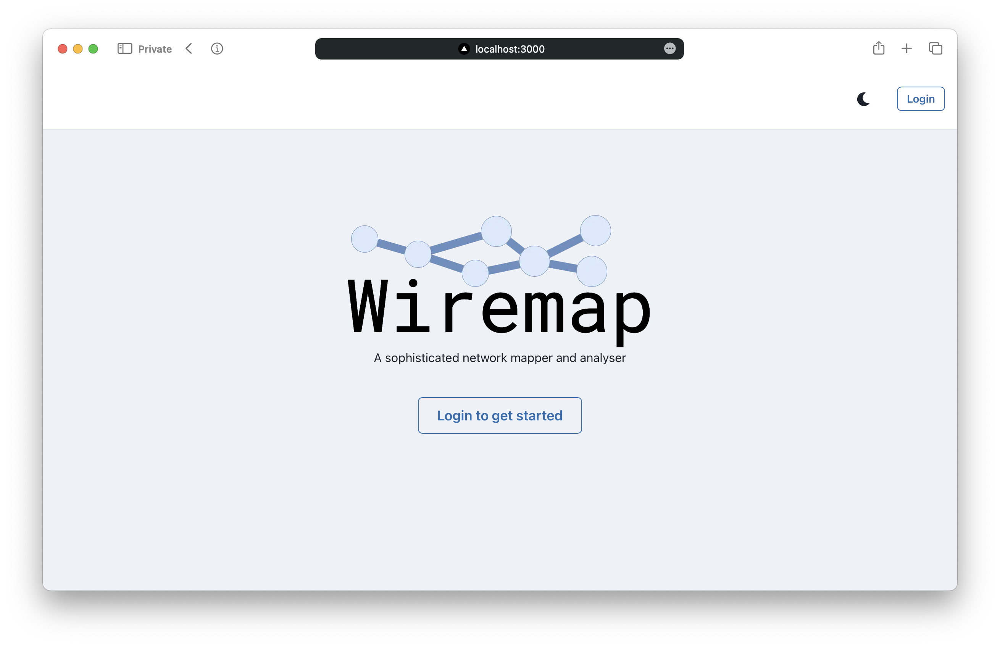

# Wiremap screenshots<!-- omit in toc -->

> IMPORTANT NOTICE: Some screenshots have been removed from this document due to the confidential nature of the project.

- [1. Guest page](#1-guest-page)
- [2. Keycloak login page](#2-keycloak-login-page)
- [3. Homepage](#3-homepage)
- [4. Scans page](#4-scans-page)
- [5. Scan details page](#5-scan-details-page)
- [6. Scan hosts page with modular filters](#6-scan-hosts-page-with-modular-filters)
- [7. Help and documentation page](#7-help-and-documentation-page)
- [8. Keycloak profile portal](#8-keycloak-profile-portal)
- [9. Reporting page](#9-reporting-page)

# 1. Guest page

# 2. Keycloak login page

# 3. Homepage

> IMPORTANT NOTICE: The page have been redacted due to the confidential nature of the project.

# 4. Scans page

# 5. Scan details page

> IMPORTANT NOTICE: This page have been partially redacted due to the confidential nature of the project.

# 6. Scan hosts page with modular filters

# 7. Help and documentation page

# 8. Keycloak profile portal

# 9. Reporting page

> IMPORTANT NOTICE: This page have been partially redacted due to the confidential nature of the project.